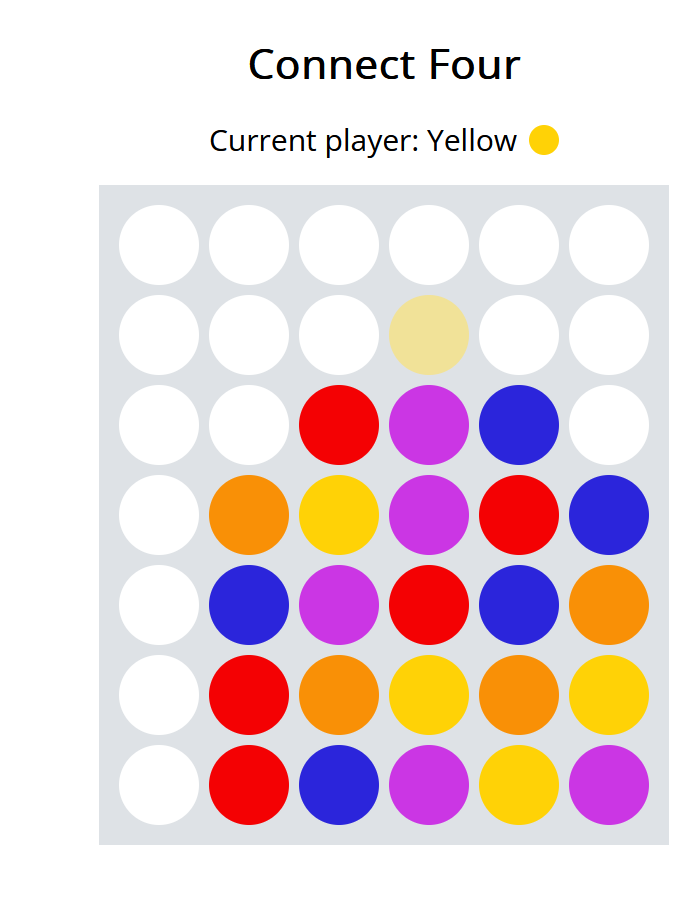
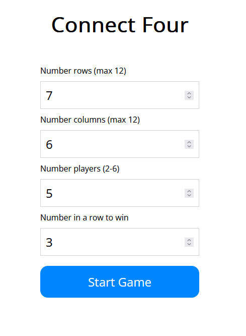

# Connect Four
Link: [Connect Four](https://connection-four.surge.sh)
## Overview
This web application is based on the classic game Connect Four where the aim is to connect a line of your coloured discs in a row, column or diagonal before your opponent does.
<p>
   
</p>

## Features
- **Customisable Rules**: Players can set the dimensions of the game board, the number of discs needed to win, and the number of players.
<p>
    &nbsp&nbsp&nbsp&nbsp
</p>

- **Responsive Design**: Game can be played on various devices of differing screen sizes


- **Accessibility**: Game can be played via keyboard only

## Technologies used
* **Bundler**: Parcel
* **Framework**: React/JavaScript
* **Linting and formatting**: ESLint, Prettier
* **Styling**: Styled Components
  
## Setup

```sh
yarn install
yarn watch
```

This will open a development server at [http://localhost:1234](http://localhost:1234).
